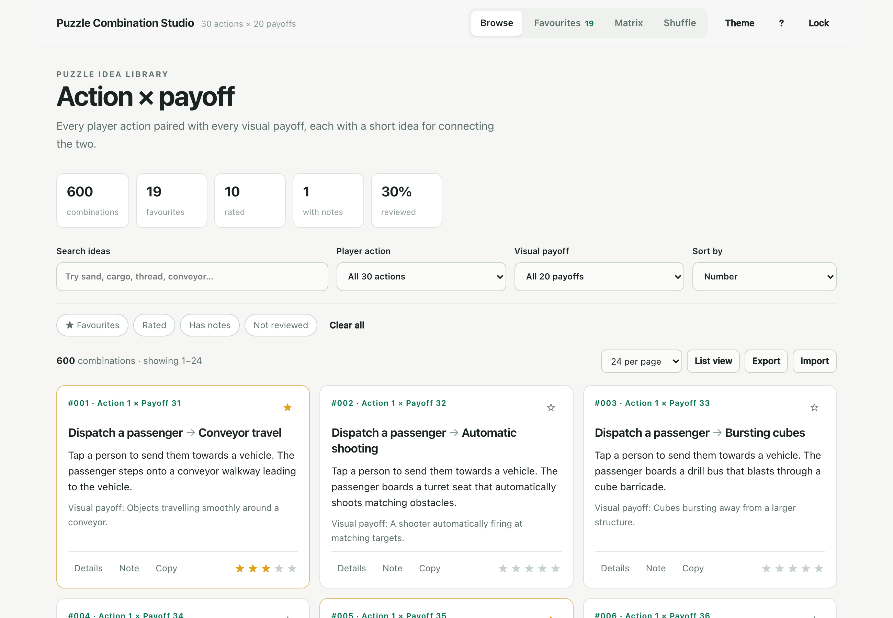
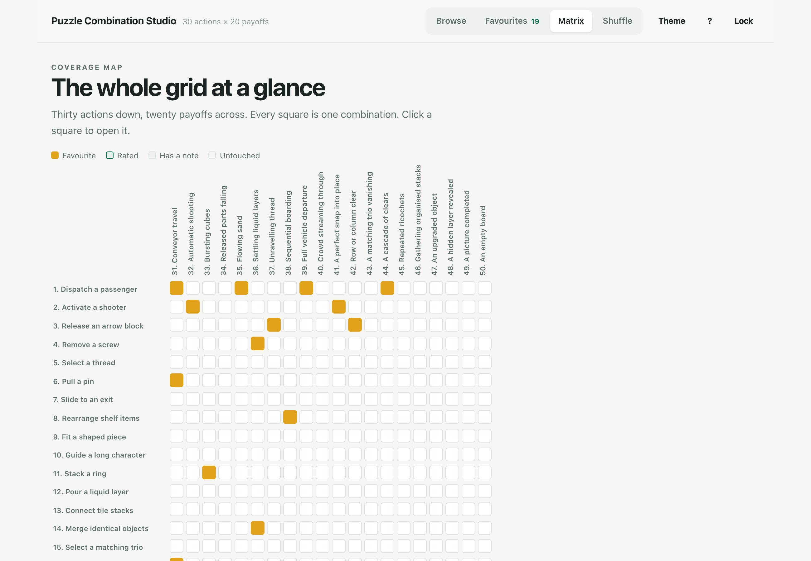

# Puzzle Combination Studio

A password-gated browser for 600 puzzle ideas: 30 player actions crossed with 20 visual
payoffs, each pair written up as a one-line mechanic.

Live site: enable GitHub Pages on this repository, then open the Pages URL.



## What it does

- **Browse** all 600 combinations as cards or as a dense list, with search-term highlighting.
- **Filter** by player action, by visual payoff, and by your own marks: favourites, rated,
  has notes, not yet reviewed.
- **Favourite** anything worth keeping and read the shortlist back on the Favourites tab.
- **Rate** each idea one to five stars and **write notes and tags** against it.
- **Matrix** view shows the whole 30 x 20 grid at a glance so you can see which parts of the
  space you have covered. Click any square to open that combination.
- **Shuffle** pulls a random combination out of whatever you have filtered, for when you want
  a prompt rather than a list.
- **Export** the current selection, your favourites, or all 600 as CSV, Markdown or JSON, plus
  a backup file of your favourites, ratings and notes that you can **import** on another machine.
- **Link to one idea**: Copy link inside any combination gives you a URL ending `#c=241` that
  opens straight to it after unlocking.
- Filters, sort order, page size and the tab you were on are remembered between visits.
- Light and dark themes, keyboard shortcuts (press `?`), and a print stylesheet.



## Sign-in

The site is static, so there is no server to check a password against. Instead the combination
library ships **encrypted**: `data/vault.json` is the dataset sealed with AES-256-GCM under a key
derived from the password with PBKDF2-SHA256 (250,000 iterations). Entering the password derives
the key and decrypts the library in the browser. A wrong password fails the authentication tag and
nothing is revealed.

That is real encryption, not a hidden `if` statement. Two things to be clear about:

1. Anyone who knows the password can read the library, and anyone with the password can share it.
2. The ciphertext is public, so the password should be a real one if the contents matter.
   Short or guessable passwords can be attacked offline.

**Default password:** `puzzle600`

### Changing the password

```bash
node tools/build-vault.mjs "your-new-password"
git commit -am "Re-encrypt the library"
git push
```

That re-encrypts `data/combinations.json` into a new `data/vault.json`. Everyone then needs the
new password; the old one stops working.

## Running it locally

The browser blocks `fetch` from `file://`, so serve the folder over http:

```bash
python3 -m http.server 8000
# then open http://127.0.0.1:8000
```

## Deploying to GitHub Pages

Push this repository, then in **Settings → Pages** set the source to the `main` branch, root
folder. The site is plain HTML, CSS and JavaScript with no build step. `.nojekyll` keeps Pages
from reprocessing the files.

To keep the library off the public web entirely, make the repository private and use Pages on a
paid plan, or host it somewhere with its own access control. On a free public Pages site the
encrypted vault is downloadable by anyone; the password is what stops them reading it.

## Files

| Path | What it is |
| --- | --- |
| `index.html` | Login screen and app shell |
| `app.js` | Decryption, filtering, favourites, notes, exports |
| `styles.css` | Theme, layout, print styles |
| `data/combinations.json` | The readable source dataset, git-ignored on purpose |
| `data/vault.json` | The encrypted dataset the site actually loads |
| `tools/build-vault.mjs` | Re-encrypts the source dataset under a new password |

## The source dataset

`data/combinations.json` is the readable text. It is **git-ignored**: committing it would put the
whole library on GitHub in the clear and make the password pointless. Keep your local copy, and
keep a backup somewhere private, because it is what `tools/build-vault.mjs` reads when you change
the password. A copy also lives in the original `600 puzzle combinations` HTML file in Downloads.

## Your data

Favourites, ratings, notes and tags live in this browser's `localStorage` under `pcs.prefs.v1`.
They never leave the machine. Use **Export → Backup** before switching browsers, and **Import**
to bring them back.
